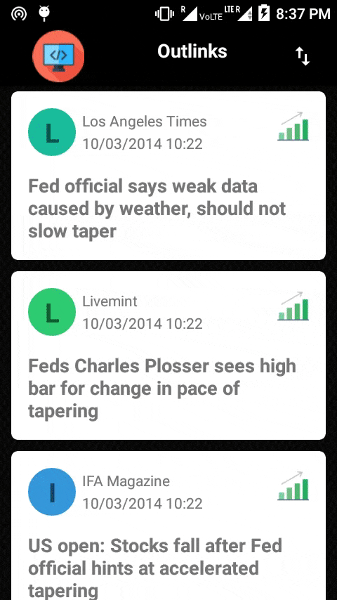
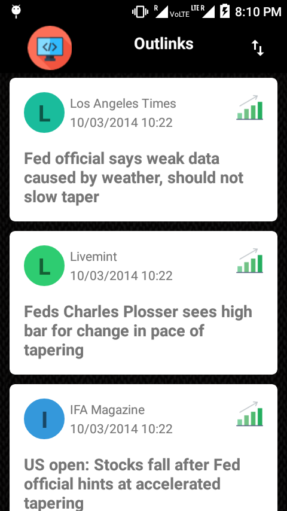
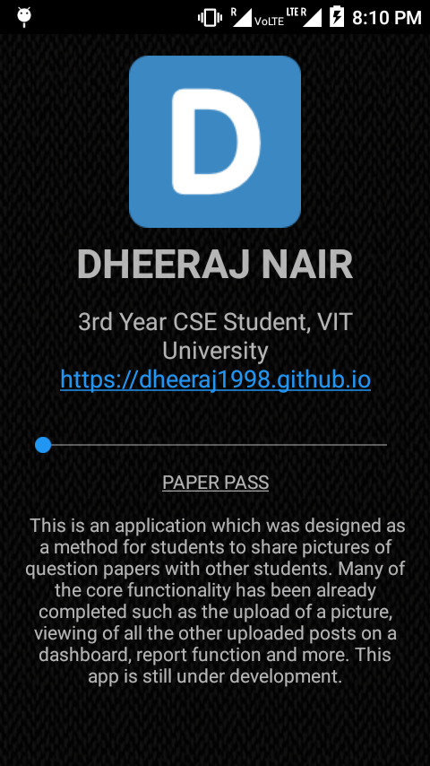
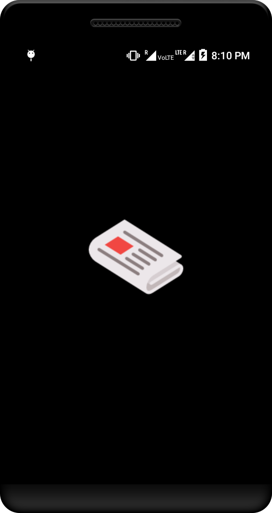

# Outlinks

</img>

  
This is the submission for a Android application development challenge by Inshorts. The competition was conducted on [HackerEarth](https://www.hackerearth.com/challenge/hiring/inshorts-android-app-development-hiring-challenge/) 
and this application was developed in under 7 hours.

## Walkthrough

</img>

## Screenshots
</img> </img> </img> 

</img>

